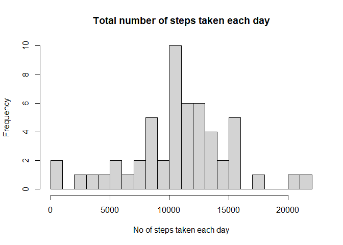

## Loading and preprocessing the data
Unzip the file and read it using the read.csv() function.

```r
unzip(zipfile="activity.zip")
data <- read.csv("activity.csv")
```

## What is mean total number of steps taken per day?
Omit the rows containing NAs.

```r
activity <- na.omit(data)
```
Calculate the sum of steps taken in each day.
Rename the columns.

```r
aggr <-  aggregate(activity$steps, by=list(activity$date), sum)
names(aggr) <- c("Date", "Sum")
```
Plot the histogram of the total number of steps taken each day.

```r
hist(aggr$Sum, breaks=25, xlab="No of steps taken each day", main="Total number of steps taken each day")
```

<!-- -->
Calculate mean and median number of steps taken each day.

```r
meanaggr <- mean(aggr$Sum)
print(meanaggr)
```

```
## [1] 10766.19
```

```r
medianaggr <- median(aggr$Sum)
print(medianaggr)
```

```
## [1] 10765
```

## What is the average daily activity pattern?
Calculate average number of steps taken per 5 Minute interval. 

```r
aggravg<-aggregate(activity$steps, by=list(activity$interval), mean)
names(aggravg) <- c("Steps", "Average")
```
load the ggplot2 library which will allow us to use it.

```r
library(ggplot2)
```
Plot the time series plot of the average number of steps taken.

```r
g <- ggplot(data=aggravg,aes(Steps, Average))+geom_line()+labs(x="Average number of steps taken", y="5 Minute intervals")+ggtitle("Average number of steps taken w.r.t time")
print(g)
```

<!-- -->
Calculate The 5-minute interval that, on average, contains the maximum number of steps

```r
max <- aggravg[which.max(aggravg$Average), 1]
print(max)
```

```
## [1] 835
```

## Imputing missing values
What I have done is replace all the missing values (NAs) with the Mean of all the non missin elements in the Column. This is how i imput all missing values.

```r
activity <- data
meanS <- mean(activity$steps, na.rm=TRUE)
for(i in 1:nrow(activity)) {
  if(is.na(activity[i,1])) {
    activity[i,1]=meanS
  }
}
```
Calculate the sum of total steps on a particular date.
Rename the resultant data's columns.

```r
aggr <- aggregate(activity$steps, by=list(activity$date), sum)
names(aggr) <- c("Date", "Sum")
```
Plot the histogram of the total number of steps taken each day after missing values are imputed

```r
hist(aggr$Sum, breaks=25, xlab="No of steps taken each day", main="total number of steps taken each day for imputed Data")
```

<!-- -->
Comparing the means of imputed data and non-imputed data we can observe no difference.

```r
print("Mean of Non-Imputed Data")
```

```
## [1] "Mean of Non-Imputed Data"
```

```r
mean(data$steps, na.rm=TRUE)
```

```
## [1] 37.3826
```

```r
print("Mean of Imputed Data")
```

```
## [1] "Mean of Imputed Data"
```

```r
mean(activity$steps)
```

```
## [1] 37.3826
```

## Are there differences in activity patterns between weekdays and weekends?
Convert the dates column to the weekday name of the date

```r
activity <- data
activity$date <- weekdays(as.Date(activity$date))
```
Create a separate column which will contain weather the date is a weekday or a weekend.

```r
for (i in 1:nrow(activity)) {
  if(activity[i, "date"]=="Saturday" | activity[i, "date"]=="Sunday") {
    activity[i, "day"] = "Weekend"
  }
  else {
    activity[i, "day"] = "Weekday"
  }
}
```
Plot the Panel plot comparing the average number of steps taken per 5-minute interval across weekdays and weekends

```r
aggr <- aggregate(steps~interval+day, data=activity, mean)
g <- ggplot(data=aggr, aes(interval, steps)) + geom_line() + facet_grid(day~.) + labs(y="Average Steps") + ggtitle("Activity Pattern based on Weekdays/Weekends")
show(g)
```

<!-- -->
